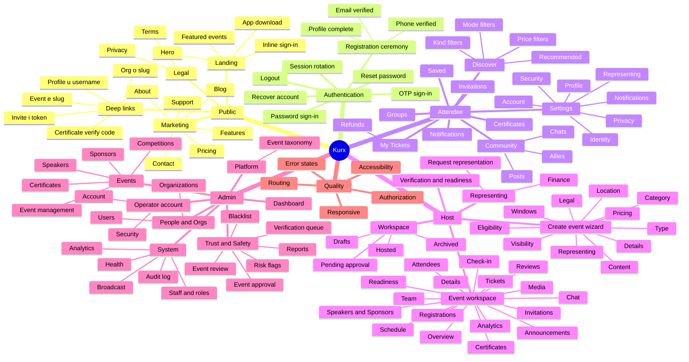

# Kurx — UI & Workflow Audit Report

> ## Status update — 2026-08-08, after the audit
>
> **The four P0s (F1–F4) are fixed and verified.** See [`docs/DECISIONS.md` → D-289](docs/DECISIONS.md)
> for the reasoning. Everything below is the audit as it was found; this box records what changed.
>
> | # | Fix | Verified by |
> |---|---|---|
> | **F1** | `publicProfileSchema.skills` accepts the nullable column and normalises to `[]` | `/u/dev_admin` `500 → 200`, with `Skills` still `NULL` in the database — the exact condition that broke it |
> | **F2** | `toIsoUtc` applied to the wizard's `startsAt`/`endsAt`; new shared `withUtcTimes` on the six other `datetime-local` forms; one shared `toLocalInput` replaces three display helpers, one of which was `iso.slice(0,16)` | Typed 10:00 → stored `10:00+05:30`; **three consecutive no-op saves, zero drift** (was 10:00 → 15:30 → 21:00) |
> | **F3** | Four schemas moved to snake_case, matching `SnakeCaseResponseConverter` | Analytics page renders (was the error boundary); all four schemas exercised with **non-empty** payloads — 1 attendee, 1 sales point, 2 revenue rows |
> | **F4** | `opsEdit` satisfied by self-representation; four pages read the capability matrix instead of `role` | Ticket type created **through the UI** by the event's owner; Announcements/Certificates/Invitations now expose their controls |
>
> **Tests:** backend `1433 passed / 1 skipped / 0 failed`; web `393 passed / 1 skipped`, typecheck, lint
> and production build clean. The new backend test was confirmed to **fail** without the fix
> (`Collection: ["view"] · Not found: "create"`), so it tests the bug rather than the code.
>
> **Not fixed** (unchanged, still open): F5–F27, listed in §12. Two corrections to the audit below,
> found while fixing:
> - **F12 was understated.** The attendee roster break is now runtime-confirmed, not inferred: the live
>   payload is `snake_case` (`ticket_id`, `buyer_name`, `checked_in_at`), and the comment above the
>   schema asserting otherwise was true when written and stale since D-259.
> - **The ticket-type sale window had F2's bug too**, which the audit missed because no ticket type
>   could be created (F4). Entering `09:00` stored `14:30 IST`. Fixed in the same sweep.
> - **New finding, not in the audit:** every authenticated page logs a **React hydration mismatch** from
>   `components/layout/theme-toggle.tsx` — the lucide icon differs between server and client render, so
>   the root falls back to client rendering ("the entire root will switch to client rendering"). Ten
>   console errors per page. Pre-existing and untouched by these fixes.

**Audit date:** 2026-08-08
**Auditor:** automated browser + source audit (Playwright/Chromium 1200×800 unless stated, viewport sweeps at 320–1280px)
**Build under test:** working tree at `/Users/naralanaveen/kurx/Kurx`, no code changes made
**Surfaces audited:** `web` (Next.js 14, `:3000`), `admin` (Next.js 14 staff console, `:3001`), `backend` (.NET 10 API, `:5080`), PostgreSQL 17
**Not audited:** `mobile/` (Flutter) — not runnable in this environment

---

## 0. How to read this report

Every finding carries an **evidence class**. These are used strictly and are never upgraded:

| Class | Meaning |
|---|---|
| **BROWSER-CONFIRMED** | Reproduced in a real Chromium page; measurements taken from the live DOM |
| **RUNTIME-CONFIRMED** | Reproduced against the running API/DB (curl/psql), no browser involved |
| **SOURCE-CONFIRMED** | Read directly in the code; mechanism is environment-independent |
| **INFERRED** | Deduced from evidence but not directly executed |
| **NOT TESTED** | Explicitly out of reach in this environment — **never** counted as passing |

Nothing that was skipped, blocked, or unavailable is reported as a pass. Section 11 lists everything that was **not** tested, and why.

### Environment caveat that shapes several results

The Next.js **dev** servers repeatedly corrupted their own chunk cache under sustained automated navigation (`Cannot find module './vendor-chunks/*.js'`, 500s on `_next/static/*`, and `loadStaticPaths`/`collectGenerateParams` TypeErrors). These are **dev-server artifacts, not product defects**, and are excluded from all findings. Where a result could not be separated from that noise, it is reported as **NOT TESTED** with the reason, not as a pass or a failure. Several intermediate readings during the audit were discarded for exactly this reason — the surviving findings are those reproduced after clean restarts, or proven by a route that does not involve the Next dev pipeline at all (curl against the API, or the SSR stack trace itself).

### Data created during the audit

The audit ran against a near-empty database (15 users, 0 events). To exercise workflows, it created:

- Event `49dec2fb-…85ba` "Kurx Audit Workshop 2026" (created via UI wizard, then published)
- Event `dffbed9e-…d9f9` "Audit Delete Test Event" (created via API, used for the delete-dialog test)
- `users.Skills` set to `{Testing}` on `audittester47` **to prove the root cause of Finding 1** — this row now differs from every other user
- `otp_codes` rows older than 2 hours deleted several times to clear the per-IP OTP rate limit

`events.StartsAt/EndsAt` on the audit event were reset once via SQL after Finding 2 was captured, so the workflow could continue.

---

## 1. Executive summary

Kurx is a large, unusually well-engineered application. The design system is coherent, the modal implementation is textbook-correct, the skip link and focus rings work, backend authorization is correct on every endpoint tested, and **not one page overflowed horizontally at any of the eight required viewport widths** except one 19px case at 320px. The routing graph is clean: no dead internal links and no genuinely orphaned routes.

The defects are concentrated in one place: **the seam between the API and the web client**, and **the host's create→sell→run pipeline that crosses it**.

Four findings are severe enough to block the product's primary job:

1. **Every user's public profile 500s** until they add a skill — the API sends `skills: null`, the web schema requires an array. This is the page every new signup gets.
2. **Saving an event's details moves it 5½ hours later, every time.** Not once — compounding. Entered 10:00 → stored 15:30 → one no-op save → 21:00.
3. **The host Analytics page never renders**, for anyone, on any event: the API answers in `snake_case`, the client parses `camelCase`.
4. **An event's own creator cannot add a ticket type to it**, which means a personally-hosted event cannot sell or register anyone through the web app at all.

Behind those sits a structural theme: the **event-creation wizard lets a host skip the step that decides what the event *is*** (Step 5, "Type") while marking it "✓ completed". The resulting event has `TypeId = NULL`, so its Readiness page reports every single module — Check-in, Announcements, Media, Chat — as "Not available for this kind of event", while the workspace above it still displays tabs for all of them. The wizard's validation gap and the workspace's contradiction are the same bug seen from two ends.

Authorization itself is sound. The backend refuses correctly at every level (anonymous → 401, non-staff → 403, staff → 200), the admin console bounces non-staff to `/forbidden`, and no unauthorized data was exposed anywhere. But the **web layer converts a 403 into a 500** on host sub-routes — an unhandled Axios rejection escaping to the error boundary — so a user who follows a stale link is told "Something went wrong on our side" when the honest answer is "not found". The codebase already implements the correct pattern on `/u/[username]` and documents it as D-018; the host workspace simply doesn't use it.

The most quietly damaging finding is operational: **an admin who forgets their password cannot reset it.** `/reset` is not in the console middleware's public path list, so the "Forgot password?" link on the login page redirects straight back to the login page.

### Severity ledger

| Severity | Count | Findings |
|---|---|---|
| **P0 — Blocks a core workflow / data corruption** | 4 | F1, F2, F3, F4 |
| **P1 — Workflow broken or misleading** | 8 | F5–F12 |
| **P2 — UI / responsive / a11y defects** | 15 | F13–F27 |
| **Verified correct** | 12 | Section 9 |

---

## 2. Application map



### Route inventory

| Surface | Pages defined | Reached at runtime | Notes |
|---|---|---|---|
| `web` | 74 | 62 static + 6 dynamic exercised | Rest are dynamic routes needing data not present (posts, chats, competitions) |
| `admin` | 27 | 25 | `/competitions/[stageId]` and `/reset` reached only indirectly |

---

## 3. P0 findings

### F1 — Every public profile 500s until the user adds a skill · **BROWSER-CONFIRMED + RUNTIME-CONFIRMED**

**Route:** `/u/[username]`
**Impact:** The public profile is the product's identity surface, reachable from Settings → "Preview public profile", from `/discover` result cards, and from any shared link. For a brand-new account it is **guaranteed** to be broken, because a new user has no skills.

**Evidence chain:**

```
Browser:  GET /u/dev_admin           → HTTP 500  ·  h1 = "This profile couldn't be loaded"
Browser:  GET /u/audittester47       → HTTP 200  ·  h1 = "Audit Tester"
```

The only difference between those two users:

```sql
UPDATE users SET "Skills" = ARRAY['Testing']::text[] WHERE "Username"='audittester47';
-- /u/audittester47 changed from 500 to 200 with this single statement.
```

API response for the failing user (`GET /v1/public/users/dev_admin` → **HTTP 200**, so the backend is fine):

```json
{ "id": "109b280e-…", "name": "Dev Admin", "skills": null, "links": null, … }
```

Web schema — `web/lib/api.ts`, `publicProfileSchema`:

```ts
skills: z.array(z.string()),     // ← not .nullable()
```

**Mechanism.** `getPublicProfile()` calls `publicProfileSchema.parse(data)`. A Zod failure is not an Axios error, so `apiErrorStatus(err)` returns `undefined`; `section()` (`web/lib/api.ts:1997`) classifies anything that is not 403/404 as `"unavailable"`; `app/u/[username]/page.tsx:57` then deliberately re-throws:

```ts
if (profileResult.state === "unavailable") {
  throw new Error(`Could not load the profile for @${params.username}.`);
}
```

The error boundary is doing exactly what it was designed to do — the schema is wrong, not the boundary. Confirmed in the SSR log:

```
⨯ app/u/[username]/page.tsx (57:11) @ UserProfilePage
⨯ Error: Could not load the profile for @dev_admin.
```

**Note on scope:** `links: null` is also returned and `links: z.string().nullable()` accepts it — so `skills` is the only mismatched field on this schema. 7 of the 8 seeded users with usernames have `Skills = NULL`.

---

### F2 — Saving event details shifts the event +5:30 hours, and compounds on every save · **BROWSER-CONFIRMED + RUNTIME-CONFIRMED**

**Route:** `/host/events/[id]/details` → "Save changes"
**Impact:** Data corruption on the single most important field an event has. An India-focused platform silently reschedules every event by exactly one IST offset per save. A host who edits a typo in the title three times moves their event 16½ hours.

**Evidence — creation:**

Entered in the wizard's Details step: `Starts at = 2026-09-15T10:00`, `Ends at = 2026-09-15T17:00`.

Event page immediately after creation:

```
STARTS  15 September 2026 at 3:30 pm
ENDS    15 September 2026 at 10:30 pm
TIMEZONE Asia/Kolkata
```

Database:

```
Title                    | StartsAt                  | EndsAt                    | Timezone
Kurx Audit Workshop 2026 | 2026-09-15 15:30:00+05:30 | 2026-09-15 22:30:00+05:30 | Asia/Kolkata
```

`15:30 IST == 10:00 UTC` — the `datetime-local` string was transmitted with no offset and persisted as UTC, then rendered in `Asia/Kolkata`.

**Evidence — compounding.** The Details form was opened and **"Save changes" pressed with no field modified**:

| Stage | Stored `StartsAt` |
|---|---|
| Typed by host | `10:00` (intent) |
| After create | `2026-09-15 15:30:00+05:30` |
| After one no-op save | `2026-09-15 21:00:00+05:30` |

The Details form pre-fills from the stored value converted to browser-local (`toLocalInput(event.starts_at)` → `2026-09-15T15:30`), then re-submits that naive string, which is parsed as UTC again.

**Source:**

- `web/components/host/create-event-wizard.tsx:196` — `startsAt: details.startsAt` (raw `datetime-local` value, no offset, no timezone applied)
- `web/components/host/edit-event-form.tsx:65` — `defaultValue={toLocalInput(event.starts_at)}` (round-trips through browser-local)

The event carries an explicit `Timezone` column (`Asia/Kolkata`) that neither side consults.

---

### F3 — Host event Analytics page is permanently broken · **BROWSER-CONFIRMED + RUNTIME-CONFIRMED**

**Route:** `/host/events/[id]/analytics`
**Impact:** The page never renders for any event or any user. It is one of 17 tabs in the event workspace and is linked from `/host/analytics` ("Reports").

**Browser result:** error boundary — `h1 = "This page couldn't be loaded"`, "Something went wrong on our side, not yours." Page reports **two H1s** (the boundary's and the event title's) and loses the console shell (`nav: 1, header: 0` vs `nav: 5, header: 1` on sibling tabs).

**Cause — response-casing contract mismatch.** The API applies `SnakeCaseResponseConverter` globally (`backend/Kurx.Api/Program.cs:319`). Four schemas in `web/lib/api.ts` declare `camelCase` fields.

Live API response:

```
GET /v1/orgs/{org}/events/{id}/analytics/attendance
{"total_tickets":0,"checked_in":0,"attendance_rate":0}

GET /v1/orgs/{org}/events/{id}/analytics/sales
[{"date":"2026-08-08T00:00:00Z","ticket_count":0,"revenue_paise":0}]
```

Client expectation (`web/lib/api.ts:611,616`):

```ts
salesPointSchema  = z.object({ date, ticketCount, revenuePaise })
attendanceSchema  = z.object({ totalTickets, checkedIn, attendanceRate })
```

SSR error, verbatim:

```
⨯ ZodError: [
  { "code":"invalid_type","expected":"number","received":"undefined","path":["totalTickets"],"message":"Required" },
  { "code":"invalid_type","expected":"number","received":"undefined","path":["checkedIn"],"message":"Required" },
  { "code":"invalid_type","expected":"number","received":"undefined","path":["attendanceRate"],"message":"Required" }
]
    at getEventAttendance (./lib/api.ts:891:29)
    at async Promise.all (index 1)
    at async EventAnalyticsPage (host/events/[id]/analytics/page.tsx:22:54)
```

Because the calls sit in `Promise.all`, one bad schema takes the whole page down.

**Full list of affected schemas** (mechanical scan of every `z.object` in `web/lib/api.ts` for `camelCase` keys):

| Schema | camelCase fields | Status |
|---|---|---|
| `attendanceSchema` | `totalTickets`, `checkedIn`, `attendanceRate` | **Breaks now** — F3 |
| `salesPointSchema` | `ticketCount`, `revenuePaise` | **Breaks now** — F3 |
| `ticketTypeRevenueSchema` | `ticketTypeId`, `quantitySold`, `revenuePaise` | Latent — array is empty today, so `z.array().parse([])` passes vacuously |
| `attendeeSchema` | `ticketId`, `ticketTypeId`, `ticketTypeName`, `buyerUserId`, `buyerName`, `buyerPhone`, `buyerUsername`, `buyerAvatarKey`, `checkedInAt`, `groupId`, `groupNumber`, `groupDisplayName` | Latent — see F12 |

---

### F4 — An event's own creator cannot add ticket types to it · **BROWSER-CONFIRMED + RUNTIME-CONFIRMED**

**Route:** `/host/events/[id]/tickets`
**Impact:** Terminal for the host pipeline. Without a ticket type there is nothing to register for and nothing to sell, so **create event → sell tickets is not completable on the web app** for a personally-hosted event.

**What the owner sees** (signed in as `dev_admin`, who is `events.CreatedBy` for this event):

```
Ticket types
No ticket types for this event yet.
Only Owners and Managers can create or edit ticket types.
```

Zero form fields, zero buttons in `main` besides the page-level `Unpublish` / `Close`. The message names the user's own role as the reason they are excluded.

**Backend agrees** — `GET /v1/orgs/{personalOrgId}/workspace-capabilities` as the owner:

```json
"representation": { "kind": "personal", "authority": null, "represented_as": "self" },
"trust":          { "trust_level": "L1", "organizer_level": "unverified", "can_host_paid_events": false },
"permissions":    { "events": ["view","create","update","delete","manage"],
                    "tickets": ["view"],          ← view only
                    "attendees": ["view"], "forms": ["view"], … }
```

**Mechanism.** `web/lib/event-org.ts` derives `role` from `caps.representation.authority`, which is `null` for a personal representation:

```ts
role: caps.representation.authority ?? "",
```

and `tickets/page.tsx:23` gates on that alone:

```ts
const canManage = ["owner", "manager"].includes(role.toLowerCase());
```

`event-org.ts` contains the comment that makes this a contradiction rather than a design choice:

> *"`role` is the caller's authority over the event's representation — an additional grant on top of ownership, **never the source of it** (D-268)."*

Ownership (`events.CreatedBy === me`) is never consulted, on either side of the boundary. The `permissions.tickets: ["view"]` in the backend response shows this is not purely a client bug.

**Scope note:** verified for a **Personal** event. Whether an organization-represented event grants `authority` and restores the form was **NOT TESTED** — no verified organization exists in this database.

---

## 4. P1 findings — broken or misleading workflows

### F5 — The wizard lets you skip the step that defines what the event is, and calls it complete · **BROWSER-CONFIRMED**

**Route:** `/host/events/new`, Step 5 of 11 ("Type")

Measured at Step 5:

```
radios present : 10
radios checked : 0
Continue       : ENABLED
```

Pressing Continue advanced to Step 6 and relabelled the step **"✓ Type (completed)"**. Contrast Step 4 (Category), which correctly disables Continue and shows "Choose a category to continue."

**Consequence, traced through to the running event:**

```sql
SELECT "CategoryId","TypeId" FROM events WHERE "Id"='49dec2fb-…';
 CategoryId | 373bbebe-60c6-4932-a606-ae7ca0615a33
 TypeId     |                    ← NULL
```

`/host/events/[id]/readiness` for that event then reads:

> **Before you publish** — Nothing is blocking this event from going live.
> **Modules** — UNIVERSAL: Check-in *Not available for this kind of event* · Announcements *Not available* · Media Gallery *Not available* · Feedback *Not available* · Chat *Not available* · STRUCTURE: Sub-Events, Agenda, Tracks, Booths, Venue Map, Problem Statements — all *Not available* · PEOPLE: Teams, Submissions, Scoring, Speakers, Polls, Live Q&A, Mentors, Networking, Volunteers, Custom Forms — all *Not available*

Every module the platform offers is disabled, the page says nothing is blocking publication, and the tab strip immediately above still shows **Check-in, Announcements, Media, Chat, Team** as available destinations. Three surfaces disagree, and the root cause is a Continue button that should have been disabled.

### F6 — Required-field validation is deferred to step 11 with no way back · **BROWSER-CONFIRMED**

At Step 6 ("Details") every field was left empty and Continue pressed:

```
fields: title, subtitle, description, startsAt, endsAt, venueName, city, venueAddress, capacity
required attribute on any of them : false
[role=alert] / [aria-invalid] after submit : none
result : advanced to Step 7, step marked "✓ Details (completed)"
```

Steps 7–10 accept empty input identically. Only at **Step 11 of 11** does the blocker appear:

> Still needed before this can be created:
> · Add a title of at least 2 characters (Details step).
> · Set a start time (Details step).
> · Set an end time (Details step).

with **"Create draft event" [disabled]**.

The message is well written — it names the field *and* the step. But:

- The progress stepper is **not interactive**. Measured: all 11 `<li>` children are `<span>`, `clickable: false`. The only route back is pressing **Back five times**.
- The error list contains **no links** to the offending step.
- The container is a plain `<p>`/`<div>`: `role = null`, `aria-live = null`. A screen-reader user who presses Continue on Step 10 lands on Step 11 with **no announcement that anything is wrong** — they must discover the list by browsing.
- The stepper still reads **"✓ Details (completed)"** for the step that holds all three blocking errors.

### F7 — An authorization denial renders as a server error, not "not found" · **RUNTIME-CONFIRMED + SOURCE-CONFIRMED**

**Impact:** Correctness of the security *presentation*, not of the security itself. **No unauthorized data was exposed** — see Section 7. But a user following a stale or shared link is told the platform is broken instead of that the page isn't theirs.

Clean API probe as a non-owner, non-staff user (curl, no Next.js involved):

```
GET /v1/events/{id}                                        → 200   (published event, readable)
GET /v1/orgs/{org}/workspace-capabilities                  → 200   (caller-scoped, correct)
GET /v1/orgs/{org}/events/{id}/ticket-types                → 403
GET /v1/orgs/{org}/events/{id}/analytics/attendance        → 403
```

The backend is correct. The web page does not handle the 403 — SSR stack trace, verbatim:

```
⨯ AxiosError: Request failed with status code 403
    at async listOrgTicketTypes (./lib/api.ts:1918:22)
    at async EventTicketsPage (host/events/[id]/tickets/page.tsx:36:25)
  digest: "3303533041"
```

**Why the guard misses.** `requireEventOrg()` protects only the first call:

```ts
const event = await getEvent(session.accessToken, eventId).catch(() => notFound());
```

For a **published** event that call returns 200 for any signed-in user, so `notFound()` never fires. The org-scoped sub-resource call that follows (`listOrgTicketTypes`) is unguarded, and its 403 escapes to the error boundary.

`/host/events/[id]` (overview) was confirmed to return **404** correctly for the same user — so the boundary is inconsistent between the overview and its sub-tabs.

The codebase already has the right pattern, in `app/u/[username]/page.tsx`, with the reasoning written out:

> *"A 403 is a normal outcome — the viewer isn't entitled to that section — and renders as absence. A 5xx… is NOT."*

The host workspace does not use `section()`.

**NOT TESTED:** the exact HTTP status returned by each of the 16 sub-tabs for a non-owner. A probe produced `404 / 500 / 307` in varying mixes across runs, but the Next **dev** server's `loadStaticPaths` worker was emitting its own unrelated 500s at the same time and the two could not be separated. The *mechanism* above is proven and environment-independent; the per-route status table is not, and is deliberately omitted rather than guessed. Re-test against `next build && next start`.

### F8 — An admin who forgets their password cannot reset it · **BROWSER-CONFIRMED**

**Route:** `admin` `/reset`

```
1. GET http://localhost:3001/login              → 200, page shows "Forgot password?"
2. The link's href                              → /reset
3. Click it                                     → redirected to /login?next=%2Freset
4. Page shown                                   → the login page again
```

The loop is closed: there is no path from the login page to password reset.

**Cause** — `admin/middleware.ts`:

```ts
const PUBLIC_PATHS = ["/login", "/forbidden"];
```

`/reset` is absent, so the middleware's `!isPublic && !hasSession` branch redirects it to `/login`. The page at `admin/app/reset/page.tsx` exists and is unreachable to precisely the population it serves — an operator who is locked out.

### F9 — Web loses the user's destination on auth redirect; admin doesn't · **BROWSER-CONFIRMED + SOURCE-CONFIRMED**

Requesting a protected web route without a session redirects to:

```
http://localhost:3000/?login=required#login
```

`web/lib/session.ts:48`:

```ts
if (!session) redirect("/?login=required#login");
```

The target is a string literal — the requested path is never captured. After signing in the user lands on `/discover` (the default), not where they were going. A shared link to `/tickets`, `/certificates`, or an event workspace is therefore lost the moment the session has expired.

The admin console does this correctly (`admin/middleware.ts`):

```ts
url.searchParams.set("next", pathname);
```

**Verified end-to-end:** `GET /verification` while signed out → `/login?next=%2Fverification` → after OTP sign-in, landed on `/verification`. The correct behaviour already exists in the codebase; web doesn't use it.

### F10 — The OTP error tells the user to do something the screen cannot do · **BROWSER-CONFIRMED + SOURCE-CONFIRMED**

Entering a wrong code produces a genuinely good error state:

```
[role=alert] : "That code didn't work. Request a new one and try again."
input aria-invalid : "true"
```

But the OTP stage of `web/components/auth/otp-panel.tsx` contains exactly two controls:

| Line | Control |
|---|---|
| 298–299 | `Verify code` |
| 311–316 | `Back to password sign-in` |

There is **no resend control, and no way to change the phone number** — the phone input is `disabled` once a code is sent (measured: `disabled: true`). The instruction "Request a new one" can only be followed by abandoning the flow via "Back to password sign-in" and starting over.

### F11 — A rate-limit lockout is reported as a bad phone number · **BROWSER-CONFIRMED + RUNTIME-CONFIRMED**

The API returns a fully-formed, structured rate-limit response:

```json
{ "title":"Too Many Requests", "status":429, "detail":"rate_limited",
  "retryAfterSeconds":3600, "error":"rate_limited", "traceId":"…" }
```

The UI renders:

> **Couldn't send a code. Check the number and try again.**

The number is correct; the user is locked out for an hour. `retryAfterSeconds` is discarded, and the copy blames the one thing that isn't wrong — sending the user into a loop of re-checking and re-submitting a valid number, each attempt confirming the lockout. The limit is `_maxPerIpPerHour` counted over `otp_codes` (`backend/Kurx.Infrastructure/Auth/AuthService.cs:46-52`), i.e. **per IP** — so on shared/campus NAT this will hit real users who have done nothing.

### F12 — The Attendees page will break the moment an event has one attendee · **SOURCE-CONFIRMED**

`attendeeSchema` (`web/lib/api.ts:1945`) declares 12 `camelCase` fields (`ticketId`, `buyerName`, `checkedInAt`, `groupDisplayName`, …) against an API that serialises `snake_case` globally. Today `/host/events/[id]/attendees` renders "0 attendees" because `z.array(attendeeSchema).parse([])` succeeds vacuously on an empty list.

This is the identical mechanism as F3, which is **BROWSER-CONFIRMED** on the analytics route — the only reason this one is not is that no attendee could be created (see F4: no ticket types can be made, so nobody can register).

**NOT TESTED with real data**, and explicitly not claimed as passing: the current "0 attendees" render is not evidence the page works.

### Publish bypasses the review queue — **partially tested**

On a Draft, the toolbar offers **`Submit for Review`**, **`Publish`** and **`Delete draft`** side by side. Clicking `Publish` transitioned Draft → Published **immediately, with no confirmation dialog**, and the toolbar became `Unpublish` / `Close`. `admin` `/events/pending` continued to show "Event approval (0)".

The account used holds `SuperAdmin`, and `EventService.CreateAsync`/`TransitionAsync` take an `isAdmin` flag — so this is very likely the documented admin waiver, not a gate failure. **NOT TESTED:** the same action as a non-admin host. Two enabled primary actions with no explanation of which applies to you is a UI issue regardless (see F23).

---

## 5. Responsive audit

Method: `page.setViewportSize()` at each width, full navigation, then measurement of `documentElement.clientWidth` / `scrollWidth` plus a walk of every element in `body` recording any whose `getBoundingClientRect().right` exceeds the viewport and which is **not** inside an ancestor with `overflow-x: auto|scroll|hidden`.

11 pages × 8 widths = **88 measurements**. One page/width combination (`/` at 320px) raced its first navigation and returned an execution-context error; it was **re-run individually** and is reported below on the re-run's data.

### Page-level overflow

**`documentElement.scrollWidth === clientWidth` on 87 of 88 measurements.** The single exception:

| Route | Viewport | `clientWidth` | `scrollWidth` | Overflow | Offending element |
|---|---|---|---|---|---|
| `/` (public landing) | **320** | 320 | **339** | **19px** | `div.flex.items-center.gap-1.sm:gap-2` (header actions: हिन्दी · theme · Log in · App), `right = 340` |

Clean at 375, 390, 414, 640, 768, 1024, 1280 (`scrollWidth − clientWidth = 0` at each). This is a 320px-only defect in the public header's action cluster — **BROWSER-CONFIRMED**.

### F13 — Public header navigation disappears below 1024px with no mobile menu · **BROWSER-CONFIRMED**

Visible `header` controls, measured by `getBoundingClientRect().width > 0`:

| Width | Visible in header | Menu toggle? |
|---|---|---|
| 320 | Kurx · हिन्दी · theme · Log in | **none** |
| 375 | Kurx · हिन्दी · theme · Log in | **none** |
| 414 | Kurx · हिन्दी · theme · Log in | **none** |
| 640 | Kurx · हिन्दी · theme · Log in · Continue · App | **none** |
| 768 | Kurx · हिन्दी · theme · Log in · Continue · App | **none** |
| 1024 | Kurx · **Features · Pricing · About · Support · Contact** · हिन्दी · theme · Log in · Continue · App | **none** |

Five marketing destinations are `display:none` from 320px to 1023px, and no hamburger, sheet, or disclosure replaces them. `document.querySelector('header button[aria-expanded], header [aria-label*="menu"]')` returns `null` at every width.

Mitigation: the **footer** still links all five, so the pages remain reachable by scrolling to the bottom. This is degraded navigation, not a dead end.

### F14 — Mobile bottom-nav "More" is clipped and under-sized at 320px · **BROWSER-CONFIRMED**

Measured on `/discover`, `/workspace`, `/settings`, `/tickets`, `/host/events/new`, `/host/events/[id]` at `width = 320`:

```
Home       42×56  right=42
Community  75×56  right=117
Posts      41×56  right=158
Messages   67×56  right=224
Workspace  73×56  right=297
More       38×56  right=335      ← viewport is 320
```

The fifth item extends **15px past the viewport** inside a `position: fixed` bar, so it cannot be reached by scrolling — the label is simply cut. Its hit area is **38px wide**, below the 44×44 CSS-px touch-target guideline (height 56px is fine).

Clean from 360px up: no clipping at 360, 375, 390, 414, 768.

"More" is the only route to Invitations, My Tickets, Saved, Groups, Create event, Settings on mobile — confirmed by opening it: `role="dialog"`, `aria-modal="true"`, contents `[Invitations, My Tickets, Saved, Groups, Create event, Settings, Review, Fraud, Org tools]`.

### F15 — Dense tab strips scroll horizontally with no affordance · **BROWSER-CONFIRMED**

Contained overflow (correct pattern, but a large amount of hidden content and no visual scroll cue):

| Surface | Viewport | Container | `clientWidth` | `scrollWidth` | Hidden |
|---|---|---|---|---|---|
| Event workspace tabs (17 tabs) | 1200 | `nav.flex.gap-1.overflow-x-auto` | 896 | **1721** | 825px — the last **7** tabs (Announcements → Reviews) |
| Workspace sub-tabs (4 tabs) | 320 | `nav.flex.gap-1.overflow-x-auto` | 288 | **451** | 163px — "Pending Approval", "Archived" |
| `admin /events` table (12 cols) | 1200 | `div.overflow-x-auto.rounded-lg` | 894 | **1179** | 285px |

All three are properly scoped `overflow-x: auto` containers — the page itself never overflows, which is why the page-level table above is clean. The finding is that on a **1200px desktop** window, 7 of the 17 event tabs are invisible with no arrow, gradient, or scrollbar hint indicating more exists.

### Other responsive observations

- **Fixed elements:** below 1024px a 57px-high bottom nav is fixed (`inset-x-0 bottom-0`); `main` carries `pb-20 sm:pb-24 lg:pb-6`, so content is not obscured. At ≥1024px the sidebar becomes `fixed inset-y-0 left-0 w-64` and `main` is offset by `lg:pl-64`. **No overlap observed at any width.**
- **Public event page** (`/e/[slug]`) has a 77px fixed bottom bar below 1024px; no clipping measured.
- **Small controls** (`<24px` in either dimension) per page ranged 0–6, mostly decorative icon links and the admin table's inline row actions.

---

## 6. Accessibility audit

> **Screen-reader disclaimer, stated plainly:** no screen reader (VoiceOver, NVDA, JAWS) was run. Every finding below comes from the **live accessibility tree** (Playwright's ARIA snapshot), computed DOM state, and real keyboard interaction driven through the browser. Where a claim concerns *reading order*, it describes the accessibility-tree order and the DOM order, which is what a screen reader linearises — but the assistive-technology experience itself is **NOT TESTED**. **Colour contrast was not measured** and is **NOT TESTED**.

### Verified working

| Check | Result | Evidence |
|---|---|---|
| Skip link | **Correct** | First Tab focuses `a[href="#main-content"]` "Skip to content", visible at `16,16`, `outline: 2px solid rgb(37,99,235)`. Enter moves focus to `MAIN#main-content`, which carries `tabindex="-1"` — focus genuinely moves, not just the hash |
| Focus visibility | **Correct** | 12 consecutive Tab stops sampled on `/settings`: every one reported `outline: 2px solid`. No `outline: none` encountered |
| Landmarks | **Correct** | `main:1, header:1, footer:1` on public pages; `main:1, nav:4–5, header:1` in the app shell; navs are individually named (`Primary`, `Secondary`, `Platform review`, `Progress`) |
| Wizard step announcement | **Correct** | `<div role="status">Step 4 of 11: Category.</div>` updates on each step |
| Wizard radio grouping | **Correct** | `group` with accessible name "Who are you hosting this event as?" |
| Form-field labelling (wizard Details) | **Correct** | All 9 inputs have a matching `<label for>`: Title, Subtitle, Description, Starts at, Ends at, Venue name, City, Venue address, Capacity |
| Error announcement (OTP) | **Correct** | `role="alert"` + `aria-invalid="true"` on the input |
| Table semantics | **Correct** | `admin` tables use `<thead>` with `<th scope="col">` |

### F16 — ConfirmDialog is excellent; one gap · **BROWSER-CONFIRMED**

Tested on `/host/events/[id]` → "Delete draft":

```
role            : dialog
aria-modal      : true
aria-labelledby : :R56fnjssv6j6:      (present)
aria-describedby: null                ← the gap
focus on open   : moved inside the dialog
Tab trail (6)   : IN Cancel → IN Delete draft → IN Close → IN Cancel → IN Delete draft → IN Close
Escape          : closes; focus returns to the "Delete draft" trigger
```

The focus trap cycles correctly and never escapes — this is a textbook implementation. The only defect: the consequence text — *"Everything set up on it — schedule, ticket types, registration form — goes with it. This cannot be undone."* — is not associated via `aria-describedby`, so it is not announced with the dialog's name on open.

The mobile "More" drawer was tested the same way: `role="dialog"`, `aria-modal="true"`, `aria-labelledby` present, `aria-expanded="true"` on the trigger, focus moved inside, **Escape closes it and returns focus to the "More" button**. (An earlier reading suggested Escape did not work; re-testing with a longer settle showed it does. Reported here as correct.) Minor: the trigger has no `aria-controls`.

### F17 — Phone inputs have no accessible name (web) · **BROWSER-CONFIRMED**

`/` sign-in panel, OTP stage, measured from the DOM:

```json
{ "type":"tel", "placeholder":"Phone number", "aria-label":null,
  "aria-labelledby":null, "id":"", "matching <label for>": none }
```

The adjacent OTP field is done correctly (`id=":r0:"` with a matching label, `autocomplete="one-time-code"`, `inputmode="numeric"`, `maxlength=6`). A placeholder is not an accessible name and disappears on input, so the phone field is announced as an unlabelled text field.

The `admin` login has the same shape but **does** provide `aria-label` on its two fields — so the web app is the outlier. The admin OTP phone field, however, has `aria-label: null` and only a placeholder: the same defect.

### F18 — Interactive controls without accessible names · **BROWSER-CONFIRMED**

Scan across all swept routes for `button|a|input|select|textarea` having no text content, no `aria-label`, no `title`, no `aria-labelledby`, no wrapping/associated `<label>`:

| Surface | Route | Unnamed controls |
|---|---|---|
| web | `/discover` | search `input`, a filter-chip `<a>`, a `<button>` |
| web | `/settings`, `/settings/account`, `/settings/identity` | 1–3 `input`s each |
| web | `/groups`, `/host/representing/new`, `/host/events/[id]/{details,schedule,media,people,team}` | 1–3 `input`s each |
| admin | `/verification` | search `input`, a `textarea` |
| admin | `/events`, `/blacklist`, `/risk`, `/users`, `/audit`, `/broadcast` | search `input` |

The recurring case is a **search box with a placeholder but no label** — the single most common control on the admin console.

### F19 — Heading-hierarchy defects · **BROWSER-CONFIRMED**

| Route | `<h1>` count | Problem |
|---|---|---|
| `/tickets/refunds` | **0** | No page heading at all (`document.title = "Refunds"`, top heading is an `h3` "No refunds") |
| `/chats` | **0** | No page heading (top heading is `h3` "No conversations") |
| `/host/events/[id]/registrations` | **2** | Event title `h1` **and** "Registrations" `h1` |
| `/host/events/[id]/analytics` | **2** | Error-boundary `h1` and event-title `h1` (a symptom of F3) |
| `/discover` | 1 | Contains an **empty `<h2>`** (renders as `H2:` with no text) — announced as a blank heading |
| `admin /users/[id]` | 1 | `h1` reads "U / User" — the avatar initial plus a generic noun, naming nobody (see F22) |

Public marketing pages use `<h2>` for footer column headings (PRODUCT / COMPANY / LEGAL), which places navigation labels at the same level as page content sections.

### F20 — Wizard blocking errors are not announced · **BROWSER-CONFIRMED**

Covered in F6. The "Still needed before this can be created:" block is a plain `<p>` inside a `<div>` with `role = null` and `aria-live = null`. Arriving at Step 11 with three blocking errors produces no announcement; the `role="status"` region announces only "Step 11 of 11: Legal."

### Reading-order note (accessibility tree, not screen-reader tested)

On the authenticated app shell the tree order is: `Skip to content` → `banner` → `navigation "Primary"` (Home, Community, Posts, Messages, Workspace) → `separator` → `navigation "Secondary"` (Invitations, My Tickets, Saved, Groups, Create event, Settings) → `separator` → `navigation "Platform review"` → `banner` (Profile, Notifications, theme) → `main`.

This is a coherent order, and the skip link short-circuits it correctly. One observation: the sidebar's platform-review links are announced as **"Review (opens the admin console)"** — the parenthetical is real text inside the link, so the warning is available to screen-reader users, which is better than a `title` attribute. It is a cross-origin jump to `http://localhost:3001/...`, hard-coded rather than environment-derived.

---

## 7. Role & permission audit

### Roles found

**Platform roles** (`admin/lib/roles.ts`, backing `platform_roles` table): `SuperAdmin`, `VerificationReviewer`, `FinanceOps`, `Support`, `ReadOnlyAuditor`. `SuperAdmin` passes every gate; holding *any* role makes a user staff.

**Event-scoped authority** (`workspace-capabilities.representation.authority`): `owner`, `manager`, others; `null` for a Personal representation (see F4).

Seeded in this database: **2 SuperAdmins**, 13 users with no platform role.

### Backend authorization — **RUNTIME-CONFIRMED, correct**

Identical requests with three credentials (anonymous / non-staff user / SuperAdmin):

| Endpoint | Anon | Non-staff | SuperAdmin |
|---|---|---|---|
| `GET /v1/admin/users?q=a` | **401** | **403** | 200 |
| `GET /v1/admin/audit` | **401** | **403** | 200 |
| `GET /v1/admin/staff` | **401** | **403** | 200 |
| `GET /v1/admin/blacklist` | **401** | **403** | 200 |
| `GET /v1/admin/reports` | **401** | **403** | 200 |
| `GET /v1/admin/events/pending` | **401** | **403** | 200 |
| `GET /v1/orgs/{org}/events/{id}/analytics/attendance` | **401** | **403** | 200 |
| `GET /v1/me` | **401** | 200 | 200 |
| `GET /v1/events/{publishedId}` | **401** | 200 | 200 |

No unauthorized data was returned on any probe. `workspace-capabilities` was checked specifically for cross-tenant leakage and is **caller-scoped**: the same org id returns `permissions.events: ["view"]` to a stranger and `["view","create","update","delete","manage"]` to the owner.

### UI authorization — **BROWSER-CONFIRMED, correct**

| Check | Result |
|---|---|
| Non-staff web sidebar | **No admin links.** `hrefs matching :3001` = `[]`. For the SuperAdmin the same sidebar shows Review / Fraud / Org tools |
| Non-staff → `admin /`, `/verification`, `/staff`, `/audit` | All → **`/forbidden`**: "No admin access — This account isn't provisioned for the Kurx admin console. Ask a Super Admin to grant a platform role." with a Sign out action |
| Unauthenticated → every admin route | → `/login?next=<path>`, destination preserved |
| Non-owner → `/host/events/{id}` (overview) | **404** — "We couldn't find that page" |
| Non-owner → `/host/events/{draftId}` | **404** — drafts are correctly invisible |
| Admin console framing | `X-Frame-Options: DENY`, `X-Robots-Tag: noindex, nofollow`, `Referrer-Policy: no-referrer` on every response — treated as intentional security posture; all admin testing used top-level navigation, never an iframe |
| Session cookies | `kurx_access` / `kurx_refresh` are **httpOnly** — `document.cookie` exposes only `NEXT_LOCALE=en` |

### Route-level role gating — **SOURCE-CONFIRMED**

`admin/components/layout/nav-config.ts` declares required roles per destination and `requiredRolesFor(pathname)` resolves them by longest-href match; `admin/app/(console)/layout.tsx:29-30` enforces it using a pathname forwarded on the `x-kurx-pathname` header by the middleware. The file documents that this enforcement was previously missing — a Support admin who typed `/staff` reached the screen (the backend still refused the calls). It is now applied.

**NOT TESTED:** the four non-SuperAdmin staff roles. No `VerificationReviewer`, `FinanceOps`, `Support`, or `ReadOnlyAuditor` account exists in this database, and creating one would have meant granting production-shaped privileges to seed users. The per-role matrix below is **read from source, not executed**:

| Destination | Roles allowed (source) |
|---|---|
| Dashboard, Analytics | any staff |
| Verification Queue, Event Approval, Event Review, Blacklist | `VerificationReviewer` |
| Reports | `VerificationReviewer`, `Support` |
| Risk Flags | `VerificationReviewer`, `FinanceOps` |
| Users | `Support`, `VerificationReviewer` |
| Organizations | `Support`, `VerificationReviewer`, `FinanceOps` |
| Event Management | `VerificationReviewer` |
| Certificates, Competitions, Speakers, Sponsors, Event Taxonomy, Staff & Roles, Broadcast, Health | `SuperAdmin` |
| Audit Log | `SuperAdmin`, `ReadOnlyAuditor` |
| `/account`, `/security` | any staff (own pages) |

### Distinguishing UI from backend authorization

They agree everywhere tested, with one asymmetry worth naming: on `/host/events/[id]/tickets` the **UI** hides the create form (`canManage === false`) *and* the **backend** independently reports `permissions.tickets: ["view"]`. So F4 is not a UI-only over-restriction that a crafted request could bypass — both layers deny it. That makes F4 a genuine capability gap rather than a client bug, and means fixing the client alone would not restore the workflow.

---

## 8. Navigation & routing audit

Method: extracted every `href="…"`, `href={\`…\`}`, `href: "…"`, and `router.push/replace/redirect(…)` target from `web/{app,components,lib}` and `admin/{app,components,lib}`, normalised template interpolations to wildcards, and matched them against the route table derived from the filesystem (74 web pages, 27 admin pages).

### Results

| Check | web | admin |
|---|---|---|
| Links pointing at a non-existent route | **0** | **0** |
| Routes with no inbound reference | **0** (see below) | **0** |

**Two apparent orphans were investigated and cleared:**

- `/onboarding` — has no inbound link, but the file is a deliberate three-line compatibility redirect (`redirect("/register")`) with the reason documented in-file. **Confirmed at runtime:** `GET /onboarding` → renders `/register`. Not dead.
- Eleven `/host/events/[id]/*` tabs initially appeared unreferenced. They are built in `web/app/(app)/host/events/[id]/layout.tsx:28-60` as `` href: `${base}/readiness` `` etc., which the extractor's literal patterns missed. **Confirmed at runtime:** all render in the tab strip. Not dead.

**Two apparent dead links were investigated and cleared:** `/host/templates/*` and `/events` matched only inside **source comments** documenting bugs that were already fixed (`workspace/page.tsx:219-223` and `not-found.tsx:26-29` both narrate the removal of the broken link). No live reference exists. This is the reason the report does not recommend deleting anything — both "findings" would have been false.

### Redirects verified at runtime

| Request | Lands on | Assessment |
|---|---|---|
| `/host` | `/workspace` | Intentional |
| `/host/tickets` | `/workspace` | Intentional |
| `/host/invitations` | `/workspace` | Intentional |
| `/onboarding` | `/register` | Intentional compatibility shim |
| `/profile` | `/settings` | **See F21** |
| protected route, no session | `/?login=required#login` | **See F9** — destination lost |

### F21 — Nav label doesn't match its destination · **BROWSER-CONFIRMED**

The sidebar and the header avatar both link to `/profile`, which **redirects to `/settings`**. The page that loads is titled "Profile" but is the settings editor; the actual public profile lives at `/u/{username}` and is reachable only via a secondary "Preview public profile" link inside it. A user clicking "Profile" expecting to see their profile gets an edit form — and, per F1, the link from there to their real profile 500s.

### F22 — Admin user deep links don't resolve · **BROWSER-CONFIRMED**

`GET admin /users/109b280e-…` returns **200** and renders:

> **U** / **User** — `109b280e-8a25-b5dd-96b8-828b183b93a8`
> Account not in the current result set. Open this user from the Users list so the search term that found them is carried through — the admin API has no by-id lookup.

The **Audit trail** section below it *does* populate with that user's real entries, so the page half-works. The message is honest about the cause, but the effect stands: a bookmarked or shared link to an admin user page shows no user, and its `<h1>` names nobody. This is a route that is live but not addressable.

### F23 — Terminology drift between navigation and page · **BROWSER-CONFIRMED**

| You click / type | Page `<h1>` says |
|---|---|
| `/host/analytics` (sidebar "Reports") | **"Reports"** — but the route says analytics |
| `/host/announcements` | **"Community"** |
| `/profile` | **"Profile"** (it's Settings) |
| `admin /risk` (nav "Risk Flags") | **"Risk signals"** |
| `admin /reports` (nav "Reports") | **"Reports & moderation"** |

Also on one toolbar: **`Submit for Review`** and **`Publish`** appear side by side on a Draft with nothing explaining which path applies to this user or this event.

### F24 — Error pages drop the surrounding application · **BROWSER-CONFIRMED**

| Surface | 404 page | Landmarks |
|---|---|---|
| web | Branded — "We couldn't find that page", compass icon, one CTA "Go to the homepage" | `main:1, **nav:0, header:0, footer:0**` |
| admin | **Next.js default** — "404 / This page could not be found." | `main:0, nav:0, header:0, footer:0` |

The web 404 is deliberately minimal and its copy is carefully written to cover both "missing" and "hidden from you" (D-018). But a signed-in user who mistypes a URL loses the entire sidebar and has one link out — back to the marketing homepage, not into the app. The admin 404 has no branding or console shell at all, which is a jarring break from the rest of a polished console.

---

## 9. Workflow audit

Each workflow below was walked end-to-end in the browser unless marked otherwise.

### W1 — OTP sign-in → session → authenticated navigation · **BROWSER-CONFIRMED · WORKS**

| Step | Observed |
|---|---|
| **Entry** | `/` → "First time? Sign in with a code" on the inline sign-in panel |
| **Preconditions** | None; account is created on first verify |
| **Action** | Enter national phone (country chip `🇮🇳 +91`), press "Send code" |
| **UI response** | Phone input becomes `disabled`; a `6-digit code` input appears with `autocomplete="one-time-code"`, `inputmode="numeric"`, `maxlength=6`; helper "We sent a 6-digit code to your phone." |
| **Network** | `POST /v1/auth/otp/request` → `200 {"ok":true}` |
| **State** | Server issues a CSPRNG code, HMAC-peppered into `otp_codes` |
| **Failure — wrong code** | `role="alert"` "That code didn't work. Request a new one and try again." + `aria-invalid="true"`. **Recovery is broken — F10** |
| **Failure — rate limited** | `429` with `retryAfterSeconds: 3600` → shown as "Check the number and try again". **Misleading — F11** |
| **Success** | `POST /v1/auth/otp/verify` → tokens set as **httpOnly** cookies; redirect to `/discover` |
| **Completion** | App shell renders; sidebar composition matches the account's roles |

**Security behaviour verified:** requesting a second code **invalidates the first** — verifying with a superseded code returns `401 otp_not_found`. (This initially looked like a login bug in testing; it is correct behaviour and is recorded as a pass.)

### W2 — Create event → publish → discover · **BROWSER-CONFIRMED · WORKS WITH DEFECTS**

| Step | Observed |
|---|---|
| **Entry** | Sidebar "Create event" → `/host/events/new` |
| **Preconditions** | Authenticated. Representation defaults to **Personal** |
| **Steps 1–3** | Representing / Visibility / Pricing all pre-selected — Continue is enabled immediately, so a host can pass three decisions without making them |
| **Step 4 (Category)** | Correctly blocks: Continue disabled, "Choose a category to continue." |
| **Step 5 (Type)** | **Skippable while marked "✓ completed" — F5** |
| **Steps 6–10** | Accept entirely empty input, each marked "✓ completed" — **F6** |
| **Step 11 (Legal)** | Blocking list appears; "Create draft event" disabled. No way to jump back — **F6** |
| **Submit** | `POST /v1/events/` → `200`; router pushes `/host/events/{uuid}` |
| **Success state** | Header badge **Draft**; toolbar `Submit for Review` · `Publish` · `Delete draft`; 17-tab workspace |
| **Data defect** | Times stored 5h30m late — **F2** |
| **Publish** | `Publish` → immediate Draft → Published, **no confirmation**; toolbar becomes `Unpublish` · `Close` |
| **Discovery** | `/discover` still read *"No events found — There are no published events right now."* immediately after publish. **F25** |
| **Exit** | `/e/kurx-audit-workshop-2026` renders 200 with "Registration open"; `/workspace` counter goes `Hosting 0 → 1` |

#### F25 — Publishing an event does not make it discoverable for up to a minute, and the empty state lies · **BROWSER-CONFIRMED + SOURCE-CONFIRMED**

Immediately after a successful publish:

```
DB    : Status=Published, Visibility=Listed, ListedStandalone=t, DeletedAt=NULL, StartsAt in future
API   : GET /v1/events?page=1&pageSize=10  →  {"items":[],"total":0}
Index : SELECT count(*) FROM event_search_documents → 0
UI    : "No events found — There are no published events right now. Check back soon."
```

About a minute later the same queries returned the event and `/discover` rendered it. Discovery reads the `event_search_documents` projection, fed from the outbox by `OutboxDispatchJob` on `Cron.Minutely()` (`backend/Kurx.Api/Program.cs:587-590`). So the lag is **by design, up to ~60s** — but the empty-state copy asserts as fact that *no published events exist*, which is false and is exactly what the host who just published will read.

### W3 — Ticket type CRUD · **BROWSER-CONFIRMED · BLOCKED**

**Entry:** event workspace → Tickets tab. **Blocked at the first step** — no create affordance exists for the event's owner (**F4**). Read, update, and delete could not be reached. Reported as **blocked, not passing.**

### W4 — Booking / payment · **BROWSER-CONFIRMED · NOT AVAILABLE ON WEB**

`/e/{slug}` → CTA "Book in the app" → `/book/{slug}`:

> **Book a ticket** — Kurx Audit Workshop 2026, Tue, 15 Sept, 2026
> **Booking happens in the Kurx app** — Registration and payment for this event are completed in the app.

The web booking route exists and renders correctly, but it is an **informational hand-off, not a checkout**. There is no ticket selection, no order, no payment step, no receipt on web. The public event page also offers `Continue in app` → `kurx://event/{slug}`.

Consequently the following are **NOT TESTED** on web because no web surface implements them: payment, order confirmation, receipt/status, refund initiation, payout operations. `/tickets/refunds` renders only its empty state ("No refunds — Refunds on your orders appear here"). This matches the README's note that payments are backend-blocked (D-019).

### W5 — Organization representation request · **BROWSER-CONFIRMED (form only)**

`/host/representing` → "Represent an organization" (search, min 2 chars) or `/host/representing/new` → a labelled form explaining: *"This submits a representation request an admin verifies before it joins the registry — you become a Verified Representative on approval."* The admin side of the loop is live and populated: `admin /verification` shows **1 organization awaiting review** ("nsrit college · 1 document · submitted 17/7/2026") with `Approve` / `Request changes` / `Reject` and a signed, expiring document link (`/v1/storage/orgs/…?exp=…&sig=…`).

**NOT TESTED:** submitting a request and carrying it through to an approval decision — that would have created a permanent organization record and altered the reviewer's real queue.

### W6 — Admin sign-in → deep-link resume · **BROWSER-CONFIRMED · WORKS**

`GET /verification` (no session) → `/login?next=%2Fverification` → OTP sign-in → **landed on `/verification`**. Destination preserved (contrast **F9**).

### W7 — Destructive action → confirmation → cancel · **BROWSER-CONFIRMED · WORKS**

`Delete draft` → modal (`role="dialog"`, `aria-modal="true"`, named): *"Delete this draft event? Everything set up on it — schedule, ticket types, registration form — goes with it. This cannot be undone."* → `Cancel` / `Delete draft`. Focus trapped and cycling, Escape cancels, focus returns to the trigger. The form still submits natively via `requestSubmit()`, and `useFormStatus` disables the button while pending so a double-click cannot fire two deletes. **The strongest single piece of implementation seen in this audit.**

### W8 — Search / filter / result / detail · **BROWSER-CONFIRMED · WORKS**

`/discover` → click "Workshop" chip → URL becomes `?kind=workshop`, results narrow to "1 event found" → back button restores `/discover` with the unfiltered list. Filter state is in the URL and therefore shareable and history-correct. 20 kind chips, 3 mode chips, 2 price chips, all `<a href>` (not JS-only), so they work without hydration.

One duplication: the audit event rendered **twice** on `/discover` — once under "Recommended for you" and once under "1 event found" — with no visual distinction that the top block is a recommendation strip.

### W9 — Browser back / forward · **BROWSER-CONFIRMED · WORKS**

`/discover` → `/tickets` → `/settings/security`, then two Backs and two Forwards:

```
back → /tickets           h1 "My Tickets"
back → /discover          h1 "Discover Events"
fwd  → /tickets           h1 "My Tickets"
fwd  → /settings/security h1 "Security"
```

Correct at every step, with the right heading rendered each time.

### W10 — Session expiry → protected route → re-auth · **BROWSER-CONFIRMED · WORKS WITH DEFECT**

Server restart invalidated the session; the next protected navigation redirected to `/?login=required#login` and the sign-in panel was shown. Re-authentication succeeded, but the original destination was lost (**F9**).

### Empty states — surveyed across 20 authenticated routes · **BROWSER-CONFIRMED · STRONG**

Every list surface has a purposeful empty state that explains the mechanism rather than saying "no data":

| Route | Copy |
|---|---|
| `/tickets` | "No tickets yet — Tickets you book appear here, each with the code you show at the gate." + "Find an event" CTA |
| `/certificates` | "No certificates yet — They appear here once an organizer issues one to you." |
| `/allies` | "No allies yet — Connect with people you've worked with on Kurx." |
| `/invitations` | "No invitations yet. When an organiser invites you, it shows up here." |
| `/saved` | "Nothing saved yet. Tap 'Save event' on any event to keep it here." |
| `/posts` | "Your feed is quiet — Connect with people and follow organizations to see their posts here." |
| `/chats` | "No conversations — Open someone's profile and tap Message to start one." |
| `/blog` | "Nothing is published yet — this page says so rather than showing an empty shell." |
| `admin /reports` | "No open reports" |
| `admin /events/pending` | "No events awaiting review" |

The single exception is `/discover`'s, which states something false during the indexing window (**F25**).

---

## 10. Verified-correct inventory

Recorded so the report is not read as a defect list only. Each was actively tested, not assumed.

1. **No page-level horizontal overflow** on 87 of 88 page×width measurements (320→1280).
2. **ConfirmDialog** — role, `aria-modal`, `aria-labelledby`, focus move, focus trap cycling, Escape, focus restoration, double-submit guard: all correct.
3. **Mobile "More" drawer** — modal semantics, `aria-expanded` on trigger, focus containment, Escape + focus return: all correct.
4. **Skip link** — visible on focus, moves real focus into `main[tabindex="-1"]`.
5. **Focus rings** — `2px solid` on all 12 sampled tab stops; no suppressed outlines found.
6. **Backend authorization** — 401/403/200 correct across 9 endpoint×role combinations; no data leakage.
7. **Admin non-staff gate** — `/forbidden` with actionable copy on every console route.
8. **Admin auth redirect** — preserves `?next=` and resumes correctly.
9. **Session cookies** — `httpOnly`; `document.cookie` exposes only the locale.
10. **Admin security headers** — `X-Frame-Options: DENY`, `noindex, nofollow`, `no-referrer`.
11. **Routing graph** — 0 dead links, 0 orphaned routes across 101 pages.
12. **Browser back/forward and URL-encoded filter state** — correct.

Also worth noting: across the entire authenticated sweep of ~50 web routes and 23 admin routes, **the admin console produced zero console errors and zero failed network requests** on every page.

---

## 11. Not tested — explicitly

Listed so nothing here is mistaken for a pass.

| Area | Why |
|---|---|
| **Screen-reader behaviour** | No VoiceOver/NVDA/JAWS run. All a11y findings derive from the accessibility tree, DOM state, and real keyboard input. Reading-order claims describe tree/DOM order only |
| **Colour contrast** | Not measured. No ratios computed |
| **Payment / checkout / receipt / payout / refund** | No web implementation exists — `/book/[slug]` hands off to the mobile app (W4) |
| **Ticket type read/update/delete** | Blocked by F4 |
| **Attendee, check-in, certificate issuance flows with data** | No attendee can exist without a ticket type (F4). `attendeeSchema` break (F12) is source-confirmed only |
| **Non-SuperAdmin staff roles** | No `VerificationReviewer` / `FinanceOps` / `Support` / `ReadOnlyAuditor` account seeded; gating read from source only |
| **Publish-without-review as a non-admin host** | Only exercised as SuperAdmin, where the waiver likely applies |
| **Organization-represented event capabilities** | No verified organization exists; F4 scope confirmed for Personal only |
| **Verification / claim approval decisions** | Would have mutated a real reviewer queue and created permanent org records |
| **Per-route HTTP status for non-owner host sub-tabs** | Could not be separated from Next dev-server `loadStaticPaths`/chunk-cache 500s. Mechanism proven (F7); status table withheld. Re-test on a production build |
| **Posts, chats, allies, groups, competitions interactions** | Only empty states reachable — no seeded content |
| **Mobile Flutter app** | Not runnable here |
| **`/host/representing/[orgId]/finance`, `admin /competitions/[stageId]`** | Require data that does not exist |
| **PWA install / offline behaviour** | `(pwa) PWA support is disabled` in dev |
| **Production build behaviour** | Everything was tested against `next dev` |

---

## 12. Recommended order of work

**Fix first — each is small and each unblocks a core journey**

1. **F1** — make `skills` nullable in `publicProfileSchema` (or have the API emit `[]`). One line; unbreaks every new user's profile.
2. **F3 + F12** — rename `attendanceSchema`, `salesPointSchema`, `ticketTypeRevenueSchema`, `attendeeSchema` fields to `snake_case`. Then add a contract test that fails on any `camelCase` key in `web/lib/api.ts`, since two of these are still latent.
3. **F2** — send an offset-bearing timestamp from the wizard and the edit form, interpreting the `datetime-local` value in `events.Timezone`. Verify with a save-twice test that asserts the value is unchanged.
4. **F4** — derive `canManage` from ownership (`event.created_by === me`) OR representation authority, and grant `tickets: [create, update, delete]` to a personal owner in `workspace-capabilities`. Both layers need the change.
5. **F8** — add `/reset` to `PUBLIC_PATHS` in `admin/middleware.ts`. One array element.

**Then**

6. **F5** — disable Continue on Step 5 until a Type is chosen; stop marking unvisited/invalid steps "✓ completed".
7. **F6** — make the stepper items links, link each error to its step, and give the error block `role="alert"`.
8. **F7** — wrap host sub-resource fetches in the existing `section()` helper so 403 → `notFound()`.
9. **F9** — capture the requested path in `requireSession()` and honour it after sign-in, matching admin.
10. **F10 + F11** — add a resend control (the backend already returns `resend_cooldown` with a countdown) and surface `retryAfterSeconds` instead of blaming the number.
11. **F25** — change the discover empty state to distinguish "nothing published" from "just published, indexing".

**Then the P2 set** — F13–F24: the 320px header overflow, the missing mobile menu below 1024px, the clipped "More" tab, scroll affordances on dense tab strips, missing/duplicate H1s, unlabelled search and phone inputs, `aria-describedby` on ConfirmDialog, the `/profile` label, admin user deep links, terminology drift, and the two error pages that drop their shell.
