# Kurx — Architecture Diagrams

ER, sequence, and state diagrams for the current (post M0–M13 / D-039–D-052) system. Diagrams are
[Mermaid](https://mermaid.js.org) and render on GitHub. Grounded in
[`docs/DATABASE_TABLES.md`](../database/DATABASE_TABLES.md), [`docs/api/README.md`](../api/README.md), and
[`.claude/memory/trust-verification.md`](../../.claude/memory/trust-verification.md) — update those first,
then re-derive a diagram here if the shape changed.

> Money is `bigint` paise (`_paise`, D-004); every id is `uuid` (D-006). The two `verification_*`
> tables are **polymorphic** — `subject_id` carries no FK (D-039), shown below as dashed intent.

---

## 0. Flow — Hosting an event (user-first, D-267 / D-268)

**Users own events** (`Event.CreatedBy`, checked first by every event authorization). A **representation**
is an *attribute* of an event — branding, verification, trust, permissions, payout destination — never its
owner, never a container a person opens on the way to hosting, and never a prerequisite for creating one.
There is no "personal organization": representing yourself creates nothing.

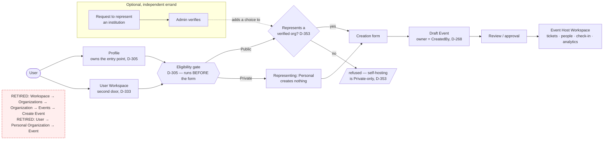

**Corrected 2026-08-15.** This flow was drawn as `Workspace → Create Event → Representing? → Event` and
was missing three things that ship today:

- **The gate.** [D-305](../DECISIONS.md) put an eligibility/verification gate *in front of* the form,
  and it also chooses Public vs Private. It is real code on both clients —
  `web/components/host/create-event-gate.tsx` and Flutter's `create_event_gate_page.dart`.
- **The entry point.** D-305 moved it to **Profile**; [D-333](../DECISIONS.md) later added Workspace
  back as a *second door* to the same gate. Both link to `host/events/new`.
- **[D-353](../DECISIONS.md).** "Personal" is no longer an unconditional path to any event — a
  **Public** event must represent a verified organization; self-hosting is **Private-only**. The server
  states this as `requires_representation` on `/v1/me` so the clients do not each infer it.

The retired paths are drawn only to name what no longer exists: there is no organization list, no
organization detail page, no per-organization event list, no "current organization" — the routes
`/orgs`, `/org/create` and `/org/:id/events/create` are gone from every client — and no personal
organization, which is neither created nor named anywhere a user or an API can see (D-268).

`events.OrgId` remains a non-null FK, so a self-represented event points at an internal row. That row is
persistence, not domain: it is resolved privately, excluded from `GET /v1/me/representations`, and
reported as `representation.kind = "personal"` with a null organization id and name.

---

## 1. ER — Identity, Trust & Verification

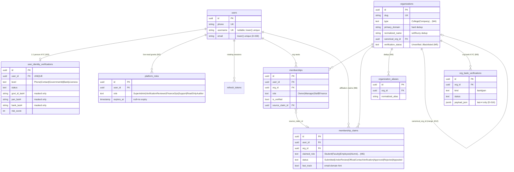

### Shared verification substrate (M0, D-039) — polymorphic, no FK on `subject_id`

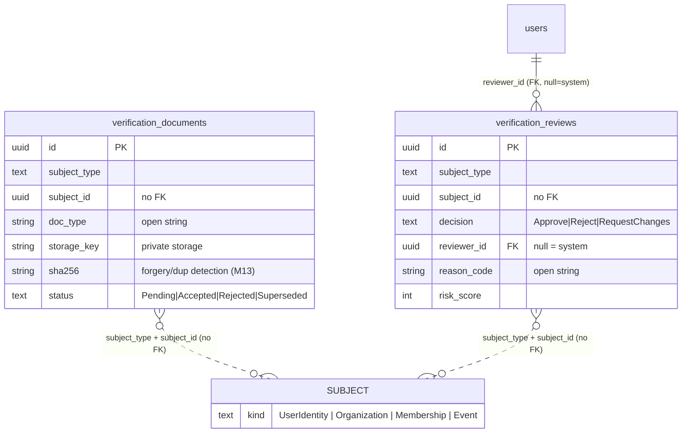

---

## 2. ER — Events, Commerce, Ledger & Fraud

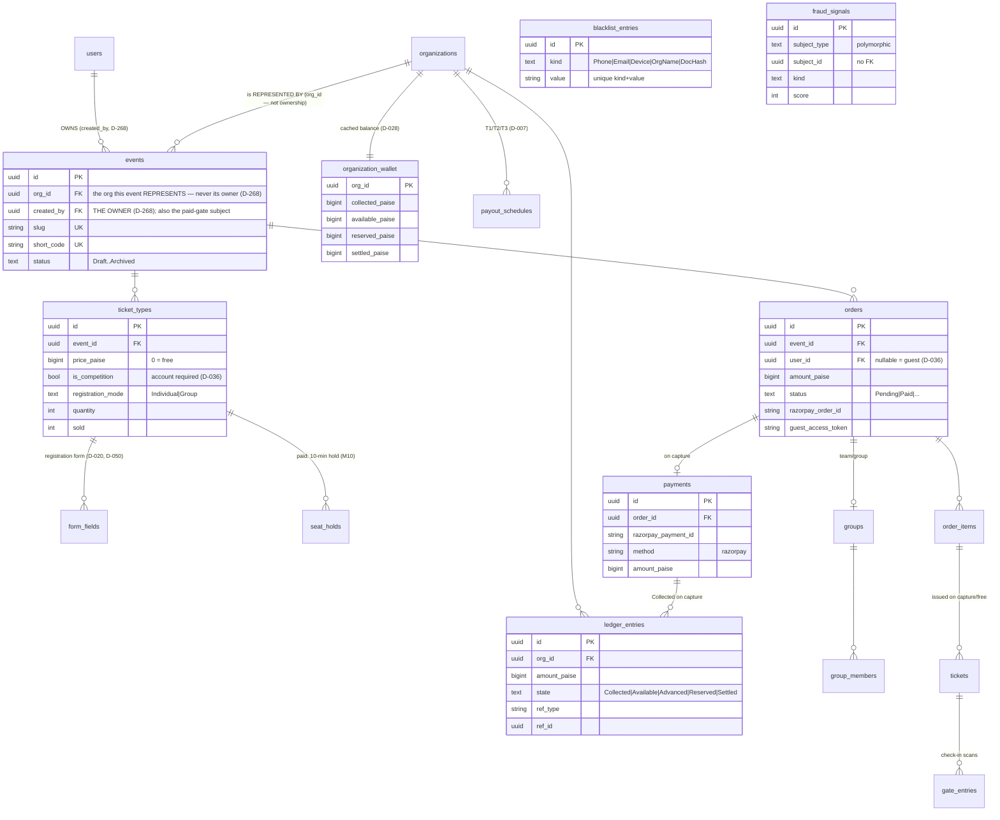

---

## 3. Sequence — Phone OTP auth + refresh rotation (D-009 / D-014 / **D-281** / D-215)

> ⚠️ **This was titled "WhatsApp OTP" and drew a WhatsApp sender. That is not merely stale — it
> contradicts a deliberate security decision.** [D-281](../DECISIONS.md) centralised channel selection
> in `OtpChannelPolicy` and made **SMS** the rail for every phone-addressed purpose (login,
> registration, recovery, password reset, device enrollment, step-up). **WhatsApp is deliberately
> excluded from authentication**: a WhatsApp account is portable across devices and recoverable through
> a takeover chain Kurx does not control, which makes it a weaker credential path than SMS. The
> provider seam, the inbound webhook and the message log all remain — WhatsApp is simply never
> *selected* for a one-time code. Email carries only `EmailLogin`/`EmailVerification`.

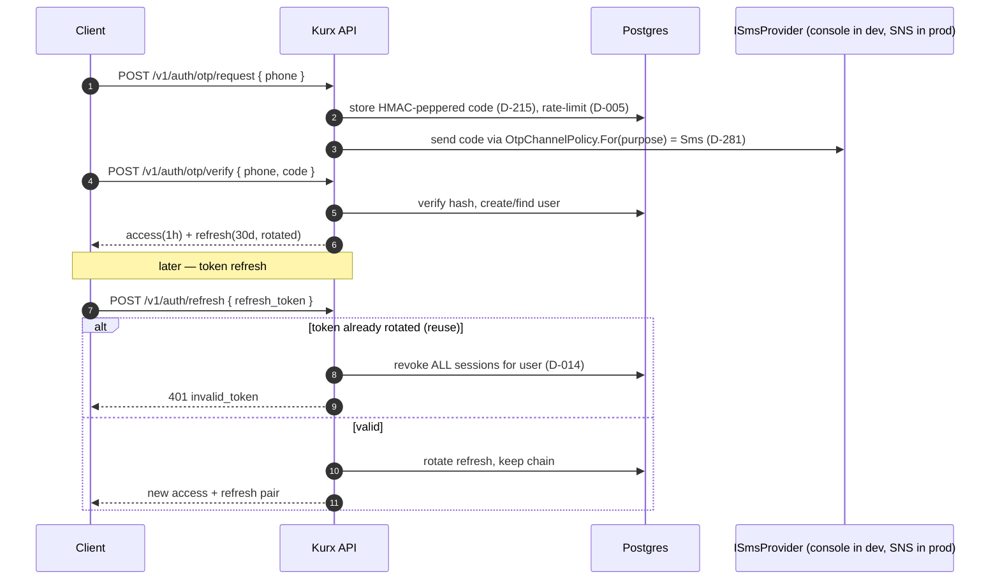

## 4. Sequence — Paid checkout → capture → ticket + ledger (M8 gate + M10, D-047/D-049)

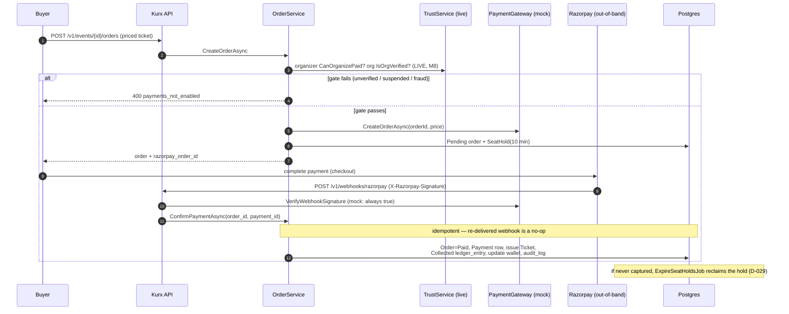

## 5. Sequence — Organization verification review (M5 / M12, D-044 / D-051)

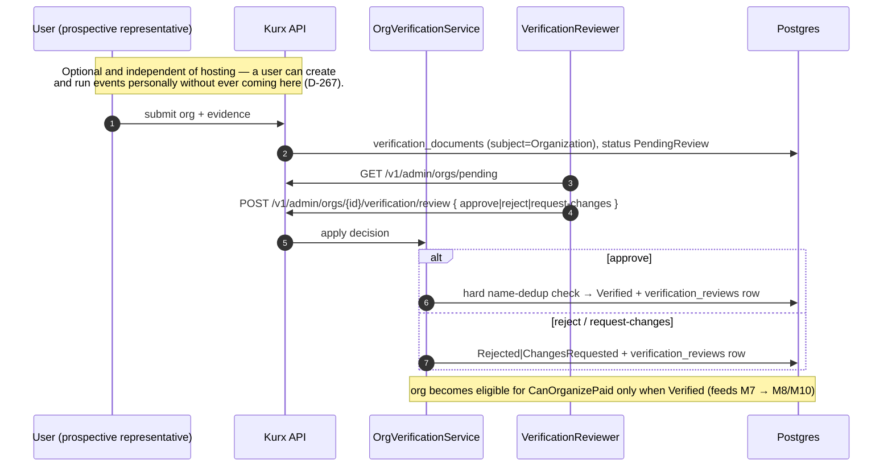

## 6. Sequence — Fraud-clear cascade (M13, D-052)

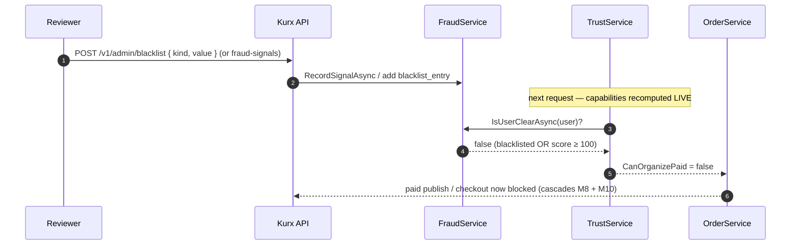

---

## 7. State — Event lifecycle (`EventStatusWorkflow`)

> Corrected 2026-08-15 against `EventStatusWorkflow.Actions`. This diagram predated **Phase 14**
> (V3 §14.1) and was missing four states — `Scheduled`, `Live`, `Completed`, `Cancelled` — and five
> transitions: `schedule`, `open_registration`, `go_live`, `complete`, `cancel`. It showed 15 of the
> 19 that exist.
>
> **`Published` is still the authoritative registration-open state** — the Phase-14 states were added
> *around* it, not in front of it, and the direct `publish` is preserved. `Cancelled` is terminal and
> deliberately has no path back to `Published`: a cancelled event is cloned, never resurrected (D-101).

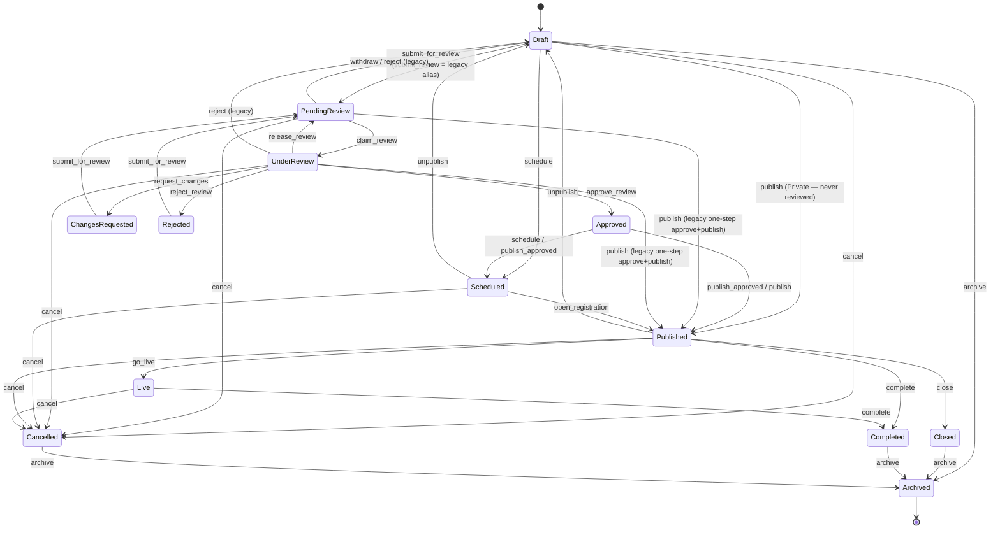

**Complete as of 2026-08-15** — all **19 actions / 37 `(From, To)` pairs** in
`EventStatusWorkflow.Actions`, deduplicated to 33 edges where two action names share a transition.
`publish` retains three legacy doors (from `Draft`, and the one-step approve-and-publish from
`PendingReview`/`UnderReview`) which are kept because clients still post them; `publish_approved` from
`Approved` is the M4 path, not their replacement. `Archived` is terminal; `Cancelled` reaches it but
never returns to `Published`.

**This is a map of which transitions exist, not of who may take them or when.** Three guards sit on top
of it and are not drawable as edges:

- **`→ Published` is gated by status *and* actor** (D-362). From `PendingReview`/`UnderReview` only a
  reviewer or admin may take it — a creator is refused `reviewer_required`. From `Approved` the creator
  takes it themselves, paid or free. The gate keys on the *target* state, so both `publish` and
  `publish_approved` pass through it. A paid event is refused `paid_event_requires_review` from `Draft`
  only, `Draft` being the one status reaching `Published` that has not been reviewed.
- **`unpublish` is refused with `event_has_history`** once the event has any order, ticket or
  registration (D-363) — from `Published` and `Scheduled` alike.
- **Only `Published` is publicly visible.** `Approved` and `Scheduled` are not; `EventExposure` carries
  the status as part of the one exposure rule.

## 8. State — Organization verification (M5, `Organization.verification_status`)

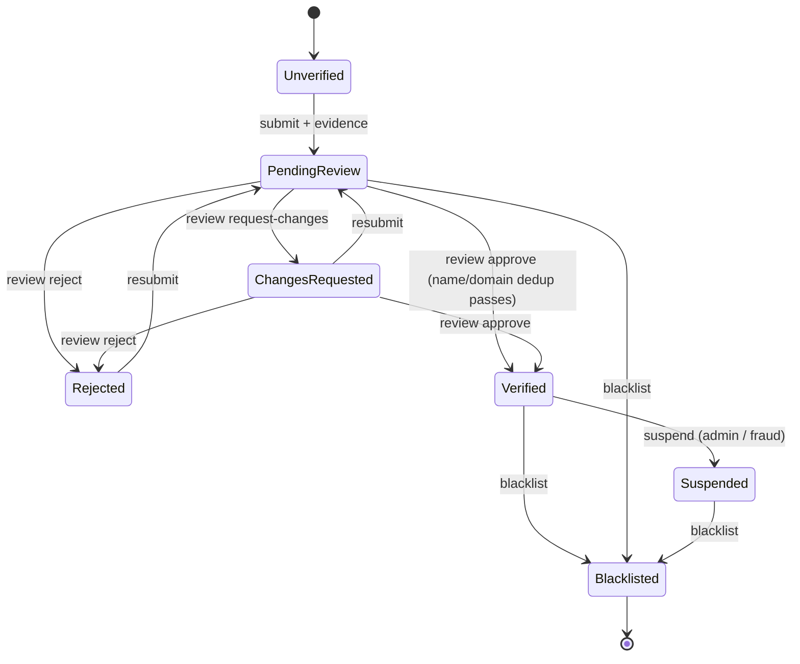

**Guards checked against `OrgVerificationService` 2026-08-15 — one edge removed, three added.**

- **`Suspended → Verified : reinstate` was drawn and does not exist.** There is no reinstate method or
  endpoint; `SuspendAsync` is one-way, `ReviewAsync` refuses anything but `PendingReview`/
  `ChangesRequested` (`not_pending`), and `SubmitAsync` explicitly refuses `Suspended`. **`Suspended` is
  terminal apart from blacklisting** — a suspended organization has no path back today.
- `ReviewAsync` accepts `ChangesRequested` as well as `PendingReview`, so an org in changes-requested can
  be approved or rejected directly without resubmitting; both edges were missing.
- `BlacklistAsync` has **no state guard at all** — any state can be blacklisted. The diagram shows the
  three reachable-in-practice sources; treat blacklist as available everywhere.
- `Unverified` is the entity default (`Orgs.cs`), never assigned by the service.

## 9. State — Person identity verification (M3, `user_identity_verifications.status`)

```mermaid
stateDiagram-v2
    [*] --> NotStarted
    NotStarted --> Submitted : submit government-id / pan / bank
    Submitted --> UnderReview : provider / reviewer picks up
    UnderReview --> Approved
    UnderReview --> Rejected
    Approved --> [*]
    Rejected --> [*]

    UnderReview --> ChangesRequested : modeled; unreachable
    ChangesRequested --> Submitted : modeled; unreachable
    Approved --> Expired : modeled; unreachable
    Approved --> Revoked : modeled; unreachable
```

**Reachability checked against code 2026-08-15.** `IdentityVerificationService` only ever assigns
`NotStarted · Submitted · UnderReview · Approved · Rejected`. **`ChangesRequested`, `Expired` and
`Revoked` exist on the `IdentityStatus` enum but have zero non-test assignment sites** — `ExpiresAt` is
projected into the response and read by nothing, and no job expires or revokes an identity. Those four
edges were drawn as if live; they are labelled here rather than deleted because the enum genuinely
carries the states, and the same convention already applies to §10's refund edges. **Reaching them is
unimplemented work, not a documentation gap.**

## 10. State — Order / payment (free vs paid, M10)

```mermaid
stateDiagram-v2
    [*] --> Paid : free ticket — issued immediately
    [*] --> Pending : paid ticket, M8 gate passed
    Pending --> Paid : Razorpay capture webhook → ConfirmPaymentAsync
    Pending --> Failed : payment failure (modeled)
    Paid --> Refunded : refund (modeled; flow deferred)
    Paid --> PartiallyRefunded : partial refund (modeled; flow deferred)
    Paid --> [*]
    Failed --> [*]
    note right of Pending : if never captured, ExpireSeatHoldsJob (D-029) reclaims the SeatHold; order stays Pending<br/>OrderStatus enum: Pending, Paid, Failed, Refunded, PartiallyRefunded
```

## 11. State — Membership claim (M6)

```mermaid
stateDiagram-v2
    [*] --> Submitted : POST membership-claims (user + evidence)
    Submitted --> UnderReview : reviewer picks up
    UnderReview --> OfficialContactVerification : verify via org's official contact
    OfficialContactVerification --> Approved
    UnderReview --> Approved : approve → verified read-only Staff seat
    UnderReview --> Rejected : reviewer reject
    Approved --> [*]
    Rejected --> [*]

    Rejected --> Appealed : modeled; unreachable
    Appealed --> UnderReview : modeled; unreachable
```

**Reachability checked against code 2026-08-15.** `MembershipVerificationService` assigns
`Submitted · UnderReview · OfficialContactVerification · Approved · Rejected`.
**`MembershipClaimStatus.Appealed` is assigned and read *nowhere* in the backend** — there is no appeal
endpoint, and the only mention of appeals is a comment in `AdminOrgEndpoints.cs` naming them as M12
work. The two edges above were drawn as live; `Rejected` is terminal in shipped code.

---

## 12. Flow — Event authority (D-269)

**Who may act on an event.** One resolution, one ordered level, every permission a threshold on it. This
is deliberately independent of the Capability Engine (D-266 M2), which answers a different question —
*what does this event support* — and the two never consult each other.

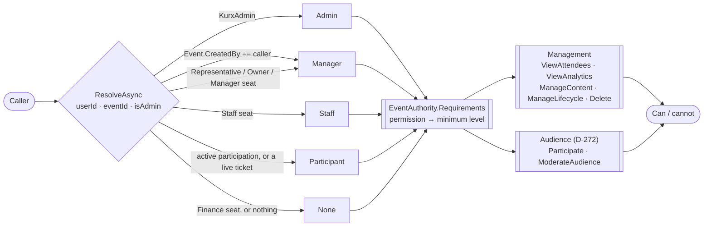

The creator branch needs **no membership** — that is what makes a personally-represented event manageable
by its owner (D-268). A new event capability adds an `EventPermission` value and one row in the
requirements table; it writes no authorization logic.

**Audience surfaces resolve here too (D-272)** — the event feed, attaching a post to an event, and chat
`Host` all threshold on this same ladder rather than querying `Memberships` themselves. An organization
membership is never, by itself, event access: every seat passes through the one `LevelFor` mapping, and
`Finance` maps to `None` on audience surfaces exactly as on management ones.
