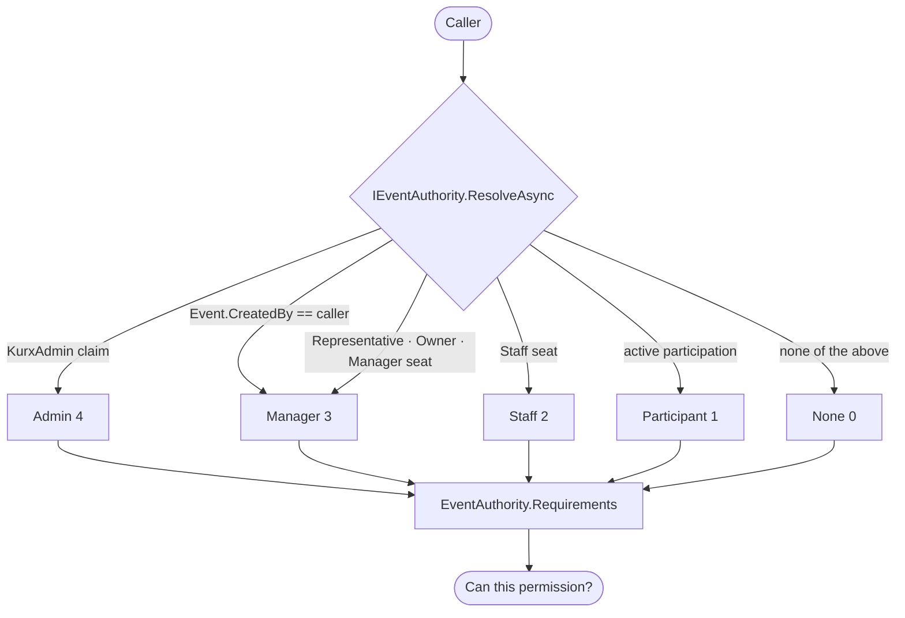

# Event Creation & Organization Representation (User-first, event-first)

Authoritative document for how a user creates an event and, optionally, represents an organization while
doing it — under the **user-first, event-first** architecture (**[D-074](../DECISIONS.md)** /
**[D-267](../DECISIONS.md)**). This supersedes any "create an organization first" flow.

## Core principle

Kurx has **Users**, **Events** and **Representations**. It does **not** have organization accounts,
organizer accounts, or **personal organizations**.

**Users own events.** The owner is recorded as `Event.CreatedBy` and every event authorization checks it
first (D-268) — ownership is not derived from membership of anything. Representation is an **attribute of
the event**, affecting only **branding, verification, trust, permissions and payout destination**:

```
User → Event          (never  Organization → Event,  and never  User → Personal Org → Event)

Representing:  Personal  |  Verified Organization  |  Request Organization Verification
```

An organization is **never** required to reach event creation, list your events, or manage one. Choosing it
is a field inside the creation form, and **Personal** — representing yourself — is always available.

**There is no hidden "personal organization" in the architecture.** `events.OrgId` is a non-null FK
(D-055/D-075 both weighed nullability and rejected it — 300+ read sites across ~30 services), so a
self-represented event points at an internal row. That row is a **persistence detail**: it is resolved
privately inside `EventService`, never named in an API, DTO, service, route, label or document, never
listed among the organizations you represent, and never shown to anyone. See D-268 for the debt this
leaves and the plan to retire it.

## The flow

> **Entry point and gate: [D-305](../DECISIONS.md) (2026-08-08).** Create Event is reached from
> **Profile**, not Workspace, and a verification/eligibility gate — including the Public/Private
> decision — runs **before** the creation form opens. D-267's "Workspace → Create Event" is superseded
> on this point only; everything below about ownership and representation is unchanged.

```
👤 Profile → Create Event
     ↓  ① PUBLIC or PRIVATE      a capability decision, not a form field
     ↓  ② FREE or PAID           Paid is inert for Private, which can never sell
     ↓     └─ the requirements THAT pair needs, and only those
     ↓  ③ the creation form      ← only now are event details entered
   Draft → review/approval → 📋 User Workspace ▸ Created / Hosted → 🏗️ Event Host Workspace
```

> **Two screens, both real questions (D-343).** There was a third screen in front of these — "Before you
> start" — which listed *Create a free event* and *Sell tickets* as bordered cards with circled check
> icons, the same chrome the real selectors use one screen later, while being inert list items. People
> clicked them expecting to choose free or paid. It is deleted: the free/paid question is now asked for
> real, and its answer is what selects the verification tier below.

**Public/Private maps to `EventProduct`, and the taxonomy still decides it.** `Event.Product` is derived
and snapshotted from the chosen Type's `EventCategory.ProductClass` (D-266 M1) and is **not** a
user-editable field. The gate's answer *filters which Types are offered*; it never overrides the
derivation. `EventProduct { Public, Private }` and `EventVisibility { Listed, Unlisted, InviteOnly }`
remain separate concepts — neither is merged, renamed or removed.

**The gate re-uses the existing trust state and adds no new verification system.** What each capability
requires is `TrustService`'s, not this document's:

| Choice | Capability | Requires |
|---|---|---|
| **Public** — free or paid | `CanCreatePublicEvent` | **identity tier**: government ID **or** PAN approved · fraud-clear |
| **Private** | `CanCreatePrivateEvent` | nothing (constant `true`) |
| Selling tickets | `CanOrganizePaid` | **financial tier**: the identity tier **plus** PAN approved · bank approved **with penny drop passed and name matched** · fraud-clear |

Which the two gate answers combine into:

| Product | Money | Requires |
|---|---|---|
| Private | Free | nothing |
| Public | Free | identity tier only — **no bank, no penny drop** |
| Public | Paid | identity + financial |
| Private | Paid | impossible — a Private event can never sell |

**Two tiers, split by what each proof establishes (D-343).** Identity answers *who is behind this event*;
the financial chain answers *whose account receives the money*. They used to be one lump, so a **free**
public event had to prove ownership of a bank account that would never receive a rupee.

**D-307's reasoning is kept and is why identity still gates Public.** Publishing to the public is itself a
trust event: a free public event still carries the platform's name and reaches every user through
discovery, and the harm a bad actor can do with one is not bounded by whether money moved. What D-307
over-applied was the *financial* half — nothing settles on a free event, so there is no account to own.

**PAN is not on the public bar.** It is a tax identity and Indian tax reporting is keyed on it, which is why
it stays mandatory for taking money. A free event reports no income, so requiring PAN there would ask for a
tax document for a non-taxable act and lock out every passport or Aadhaar holder who has no PAN.

**Penny Drop is not a separate requirement** — it is one link in the *bank ownership* chain and already sits
inside `bankVerified`, beside the name-match control. The gate names both to the user when Paid is chosen;
neither is a new predicate, and neither is shown for a free event.

**Private never asks for the financial chain.** A Private event cannot be Listed, cannot take payment, and
appears on no discovery surface — so there is no public exposure to bound and no money to settle.

**Publish-time gates still apply.** The entry gate is additive — it stops someone starting work they
cannot finish; it does not replace org verification or `paid_event_requires_review`.

**Every wizard step gates its own required fields (D-327).** `canNext` ended in `step >= 4` — an
unconditional pass covering Type, **Details**, Content, Location, Windows, Eligibility and Legal — so
`title`, `startsAt` and `endsAt` could all be skipped and the wizard first objected on step 11 of 11.
The rule now lives on the step that asks: Details requires a title and correctly-ordered times,
Registration requires a bookable ticket (and, for a paid event, the eligibility to charge — D-365), Type
is required only when the category offers one, and the Windows pairs must be ordered. `blockedReason` names the specific missing field, because "Make a choice to continue."
on a four-input step is what made the disabled button useless. **Nothing invalid could ever have been
stored** — `CreateEventBodyValidator` and `EventService` refuse all of it; this moves the refusal to
where the field is still on screen.

**Five inputs are hidden for a Private product (D-327), from two different rules.**

| Hidden | Why |
|---|---|
| Maximum teams · Results announced · Certificates released | `private-gathering` marks `teams`, `scoring` and `certificates` **Unsupported** in the D12 matrix |
| Minimum age · Maximum age | **Product judgment, not the matrix** — there is no `age` capability. Age bounds turn away a stranger who registered; a private event has no open door to turn anyone away from, because attendance *is* the invitation list |

Hidden on both web and Flutter, keyed on `product` — `Private ⇔ private-gathering` is one-to-one and
pinned by a test. The Windows step itself stays: `check-in` and `forms` are Optional for private
gatherings, so registration and check-in windows are legitimate. This **hides, it never gates** — the
Capability Engine describes and never authorizes (D-266 M2), and an unclassified Type still resolves
Public so nothing is hidden by an unknown archetype.

> **Open:** Gender is now the only field left on the Private Eligibility step, and it is arguably in the
> same position as age — a private gathering restricts by invitation, not by rule. Hiding it too would
> empty the step and it should then be dropped for Private (making the flow 10 steps, not 11). Left
> deliberately, not overlooked.

**The Type catalogue is filtered client-side on a field the server must actually send (D-326).**
`typesFor`/`allowsProduct` compare `product_class` against `"Private"`, and for a period the API emitted
no such field — so the Private branch offered **zero** categories and the Public branch offered every
private type. The filter was right; the wire was short a field its mapper never carried. Two consequences
worth keeping: the comparison is **case-sensitive** (`ToJson` deliberately does *not* lower-case
`ProductClass`, unlike `Level` one line above), and a **missing** value is indistinguishable from an
*unclassified* one because both clients treat absent as Public — which is why the test asserts that no
Type is served without the field at all, not merely that the classified ones are right.

**Outside Production the identity proofs can be switched off (D-323).** With
`IDENTITY_VERIFICATION_BYPASS=true` — which must be listed in `docker-compose.yml` as well as `.env`,
or the container never sees it — `CanCreatePublicEvent` (and `CanOrganizePaid`/`CanReceivePayout`)
stop requiring government ID, PAN and bank ownership, so a plain dev account can walk this whole flow.
The reason is that all three proofs are answered by `MockKycProvider` today — the gate above is real
logic over simulated evidence, so enforcing it in dev buys no assurance and costs four submissions per
test account. **`fraud-clear` is not part of the bypass** and still gates all three, and the flag does
not alter the `identity_verified`/`bank_verified` values the gate *displays* — the checklist tells the
truth even when the gate is open. Production refuses to start with it set. Delete it when a real
DigiLocker/penny-drop adapter ships; until then it is the only thing that makes this flow testable.

1. **Login** (phone OTP over SMS → JWT; D-281).
2. **Profile → Create Event** → the gate above → the creation form (`POST /v1/events`) → event details
   (title, schedule, venue, category, …).
3. **"Representing"** — a step of the form, not a gate in front of it:
   - **Personal** (the default) → hosted under the creator's own name. No organization, no proof, nothing to
     register, and nothing named "personal organization" anywhere the user or an API can see.
   - **An organization you already represent** → pick it from the list.
   - **An institution you don't yet represent** → that's a separate, optional errand under
     *Profile → Representing*; it never blocks the event you are creating. Search the **verified organization
     registry** (`GET /v1/orgs/search`).
4. **If the organization exists** → select it and submit **proof of authority to represent it** — an
   evidence-backed **membership claim** (`POST /v1/orgs/{id}/membership-claims`), reviewed by an admin.
5. **If the organization does not exist** → submit its details + supporting documents (letterhead,
   authorization proof, registration docs). The platform creates **only an `OrganizationVerificationRequest`**
   — **not** an `Organization`. It does **not** appear in the registry or in search until an admin approves it.
6. **Admin approval** creates the official `Organization`, adds it to the searchable registry, and links the
   requesting user as a **Verified Representative** (never "Owner"). Events attached to a still-pending request
   are marked **Pending Organization Verification** and proceed through the normal approval flow
   ([D-047](../DECISIONS.md)) once approved.

## Event ↔ organization

- A **paid** event can sell only once its organization is **Verified** and the creator is paid-capable —
  computed **live** (`GET /v1/orgs/{org}/events/{id}/payment-readiness`), never stored (D-047).
- **Free / personal** events publish directly.

## Reused machinery (not rebuilt)

Registry search (M4/D-043), the org verification lifecycle (M5/D-044), evidence-backed membership claims
(M6/D-045), the polymorphic verification substrate (M0/D-039), and the admin review console (M12/D-051) are
all reused. Event-first is an **entry-flow + staging-entity** change, not a new trust engine. See
[`.claude/memory/trust-verification.md`](../../.claude/memory/trust-verification.md).

## Implementation status (honest)

- **Backend — shipped (D-075):** the flow above is enforced by the API.
  - `POST /v1/orgs/representation-requests` stages a **hidden placeholder org** (`PendingReview`, not in the
    registry, **no Owner**); the submitter is a **pending `Representative`** (`IsVerified = false` → zero
    trust capability). Evidence reuses `verification_documents`.
  - `POST /v1/orgs` is now **personal-org-only** — a non-personal create returns `use_representation_request`.
  - `GET /v1/orgs/search` and the public org profile (`GET /v1/public/orgs/{slug}`) return **Verified orgs
    only**; a staged request never appears.
  - Admin approval (`POST /v1/admin/orgs/{id}/verification/review` → `approve`) materializes the org into the
    registry, flips the submitter to a **Verified Representative**, and provisions its wallet + payout schedule.
  - An event under a non-personal org **cannot publish** (free or paid) until that org is `Verified`
    (`pending_org_verification`); "Pending Organization Verification" is derived live, not stored.
- **Web — shipped (D-076, completed by D-267):** **Workspace** (`/workspace`) is the caller's own event list,
  with **Create Event** as a direct action and status views (Hosted / Drafts / Pending approval / Archived)
  instead of an organization browser. The wizard's first step is **Representing** (Personal by default). The
  `kurx_org` "current organization" cookie, its switcher, the organizer dashboard and `/host/organizations`
  are removed; event pages resolve their organization from the event. Registering an institution
  (a representation request with **required** proof, uploaded via the user-scoped
  `POST /v1/orgs/representation-requests/media/presign`) lives under `/host/representing`, whose only
  org-scoped child is `/host/representing/{orgId}/finance` (the payout account). The admin approval console
  is unchanged.
- **Mobile — shipped (D-267):** the Flutter app is user-first. Create Event is `/events/create`, reachable
  from Workspace with no organisation chosen first; **Representing** is the wizard's first step (Personal
  by default). Management is addressed by event (`/events/:eventId/manage/…`), which resolves its own
  organisation. `/orgs`, `/org/create`, `/org/:orgId` and `/org/:orgId/events` are removed, along with the
  organisation analytics dashboard and member roster; what is left lives under `/representing/:orgId/…`
  (verification, reached from Profile → Representing; the payout account, reached from the event's
  payment-readiness check).

## What remains organization-shaped, and why

Everything below revolves around **Users and Events**. These are the only organization-related screens
left, each tied to **representation or verification** (D-267):

| Screen | Purpose |
|---|---|
| Search the verified organization registry | Find the institution you want to represent, during the representation request |
| Request organization verification | Submit an institution + proof; an admin approves it into the registry |
| Representation details (profile/settings) | Which institutions you may act for, your authority, verification status |
| Organization verification standing | Whether the institution is verified, and whether you are a verified representative |
| Admin verification screens (`admin/`) | Platform staff reviewing the queue — oversight, not user navigation |

**Deleted as organization dashboards:** organization analytics (per-event analytics covers it) and the
organization member roster (event collaboration lives per event, at `…/manage/team`). There is no
organization home, no organization dashboard, and no organization hub page.

**Payouts are the one exception, reached only through an event.** Settlement is legally
organization-bound, so the wallet / KYC / withdraw screens are organization-scoped — but nothing
navigates to them *through* an organization: mobile reaches them from the event's payment-readiness
check, web from the representation detail as *Payout account*.

## Who may act on an event (D-269)

**`IEventAuthority` decides WHO may act. The Capability Engine decides WHAT an event supports. The two
systems are completely independent and never consult each other** — a capability is not a permission, and
a permission is not a capability. An event may *support* ticketing (capability) while a given caller may
not *manage* it (authority), and both answers are correct.

A caller resolves to exactly one authority level over one event; every permission is a threshold on it.



| Authority | Reached by | May |
|---|---|---|
| **Admin** | the `KurxAdmin` platform claim | everything except content edit (D-191 keeps that organizer-owned) |
| **Manager** | the event's **creator** — no membership required (D-268) · a `Representative` (D-075) · an `Owner`/`Manager` seat in the represented organization | manage content and lifecycle, view analytics, delete |
| **Staff** | a `Staff` seat in the represented organization | read the attendee roster; nothing that changes what is sold |
| **Participant** | an **active** participation (speaker, judge, mentor, volunteer) | view the event |
| **None** | no relationship | nothing; hidden resources answer 404, never 403 |
| — | a `Finance` seat | **nothing on events.** Money authority over an organization is not operational authority over its events. |

**Extension point.** A new event capability — polls, maps, live Q&A, networking, resources — adds one
`EventPermission` value and one row in `EventAuthority.Requirements`. It writes **no** authorization logic
and needs no new service. Anything that reaches for a private `CanManage` is re-creating the defect D-269
removed: eleven copies, seven identical, the rest drifted, hiding two live permission bugs.

**Organization-owned assets** — the speaker roster, sponsor roster, venue book, series, and representation
authority itself — resolve through `ResolveOrgAsync` on the same interface. They are library entries shared
across many events, so they cannot be answered from an event; keeping them on one interface keeps a single
role → authority mapping in the codebase.
